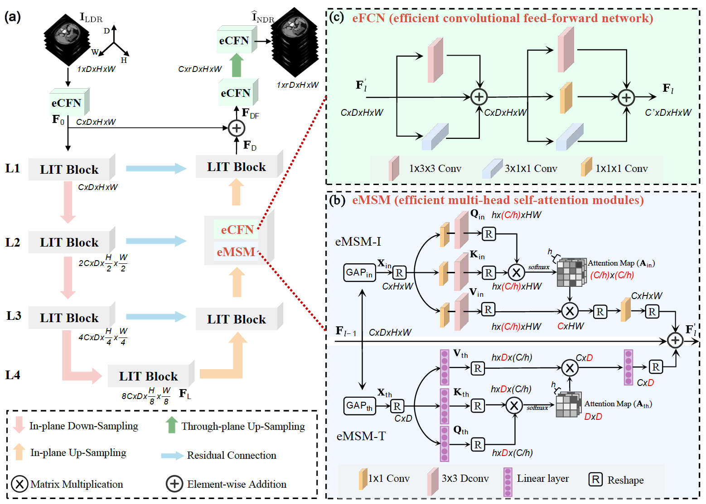

# LIT-Former: Linking In-plane and Through-plane Transformers for Simultaneous CT Image Denoising and Deblurring
This is the official implementation of the paper " LIT-Former: Linking In-plane and Through-plane Transformers for Simultaneous CT Image Denoising and Deblurring". The pre-print version can be found in [arxiv](https://arxiv.org/abs/2302.10630); the early access version can be found in [TMI](https://ieeexplore.ieee.org/document/10385173/).


## Updates
Jan, 2024: initial commit.  

## Approach


## Data Preparation
The 2016 AAPM-Mayo dataset can be downloaded from: [CT Clinical Innovation Center](https://ctcicblog.mayo.edu/2016-low-dose-ct-grand-challenge/) (B30 kernel)  
The 2020 AAPM-Mayo dataset can be downloaded from: [cancer imaging archive](https://wiki.cancerimagingarchive.net/pages/viewpage.action?pageId=52758026)   
#### Dataset structre:
```
Mayo2016/
  |--train/
      |--quarter_lr/
        train_quarter_00001.npy
        train_quarter_00002.npy
        train_quarter_00003.npy
        ...
      |--full_hr/
        train_full_00001.npy
        train_full_00002.npy
        train_full_00003.npy
        ...
  |--test/
      |--quarter_1mm
      |--full_1mm
```

## Requirements
```
- Linux Platform
- torch==1.12.1+cu113 # depends on the CUDA version of your machine
- torchvision==0.13.1+cu113
- Python==3.8.0
- numpy==1.22.3
```

## Traning and & Inference
Training
```
python train.py --is_train --dataroot (path to dataset) --checkpoints_dir checkpoints(path to save model checkpoint)  --name litformer(name of project)  --train_batch_size 64 --phase train --is_val  --gpu_ids 0,1
```

Inference & testing
```
python test.py --is_test --dataroot (path to dataset)   --name litformer(name of project)   --model_path  (path to load model checkpoint) --phase test --test_batch_size 1  --gpu_ids 0
```
Please refer to options files for more setting.


## Citation
If you find our work and code helpful, please kindly cite the corresponding paper:
```
@article{chen2024lit,
  title={LIT-Former: Linking in-plane and through-plane transformers for simultaneous CT image denoising and deblurring},
  author={Chen, Zhihao and Niu, Chuang and Gao, Qi and Wang, Ge and Shan, Hongming},
  journal={IEEE Transactions on Medical Imaging},
  year={2024},
  publisher={IEEE}
}
```

